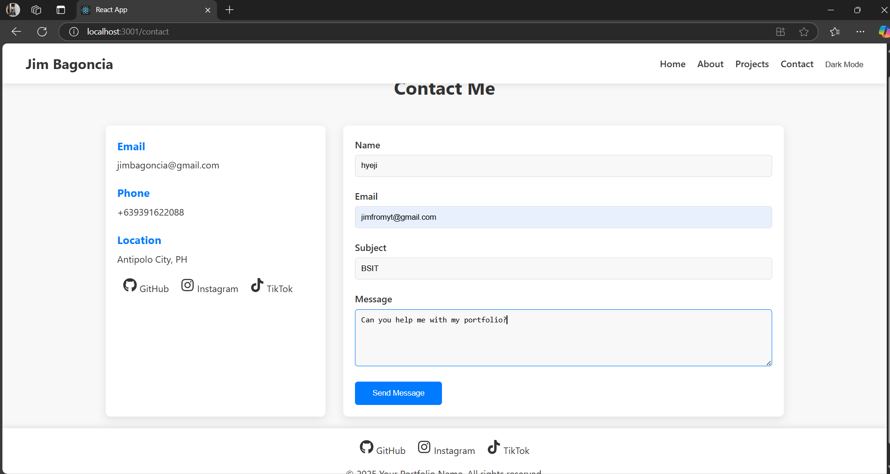
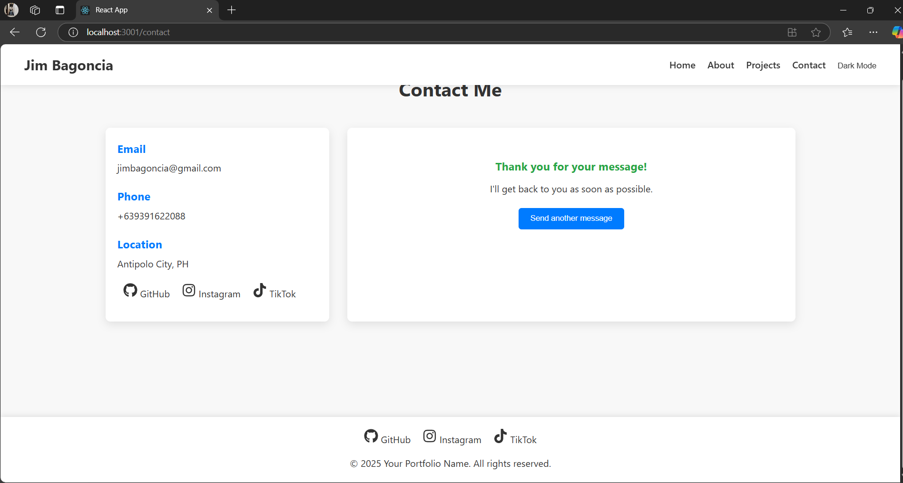
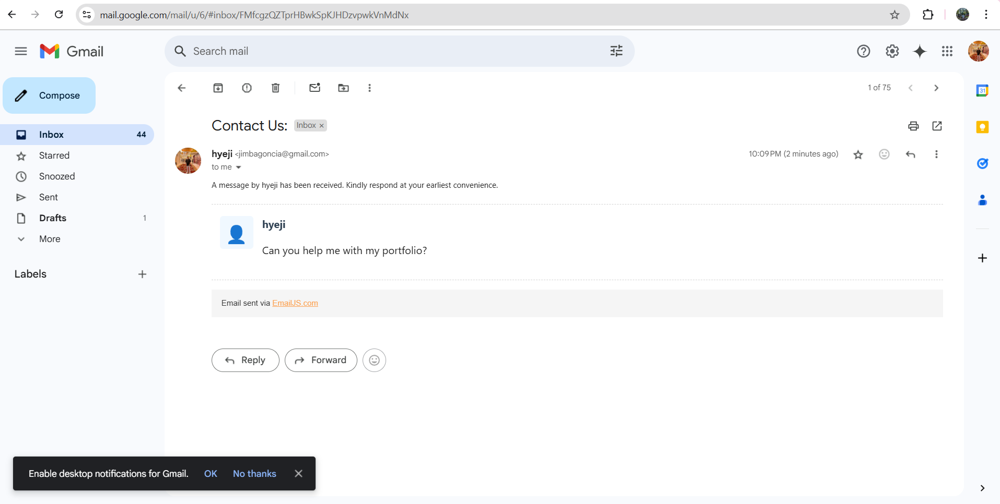

# React Personal Portfolio

A fully responsive and interactive portfolio website built with React.js, showcasing my projects and skills.

## Features
- **Responsive Design**: Adapts to all screen sizes from mobile to desktop.
- **Dark/Light Mode**: Toggle between dark and light themes.
- **Interactive UI**:
  - Typewriter effect on the home page.
  - Animated skill bars.
  - Project filtering by category.
  - Form validation on the contact page.
  
- **State Management**: Using React's `useState` and `useEffect` hooks.
- **Multi-page Navigation**: Implemented with React Router.

## Technologies Used
- **React.js**
- **React Router**
- **CSS3**
- **JavaScript ES6+**
- **EmailJS (for contact form)**

## Setup and Installation

1. Clone the repository: ("https://github.com/hyejizxc/personal-portfolio.git")

## Future Enhancements
- **Add a blog section.**
- **Implement a dark mode toggle with local storage.**
- **Add animations and transitions.**
- **Connect the contact form to a backend service.**

## Contact Form Validation (EmailJS Integration)
The contact form is connected to **EmailJS** for sending email notifications. Here's how to configure it:

1. **Create an EmailJS account** at [EmailJS](https://www.emailjs.com/).
2. **Create a service** and **template** in EmailJS.
3. **Update your `Contact.js` file** with your service and template IDs.

### Screenshots for EmailJS Validation:

- **Email Sent Email:**
   
  
- **Email Sent Successfully:**
  

- **Email Recieved:**
  

   
   

